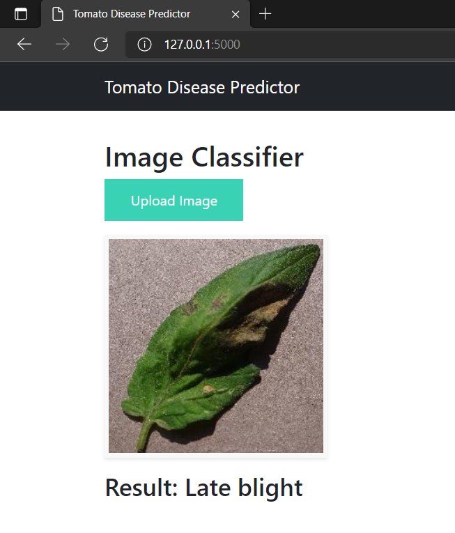
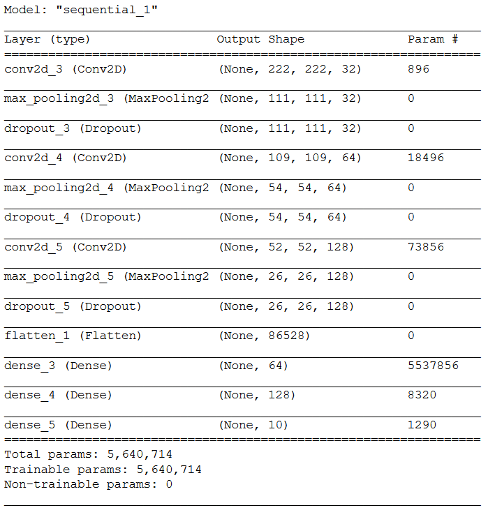
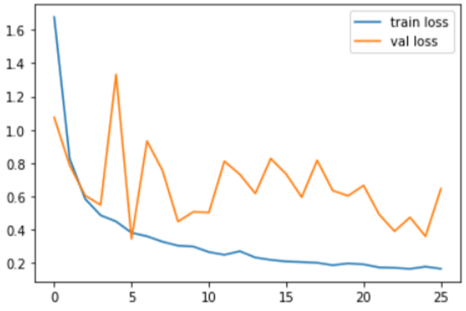
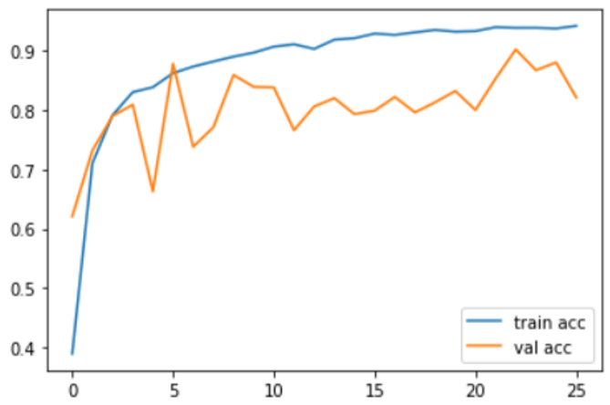

# Tomato leaf disease classification with CNN



<!-- TABLE OF CONTENTS -->
<details open="open">
  <summary>Table of Contents</summary>
  <ol>
    <li>
      <a href="#about-the-project">About The Project</a>
      <ul>
        <li><a href="#built-with">Built With</a></li>
      </ul>
    </li>
    <li><a href="#dataset">Dataset</a>
    <li><a href="#model">Model</a></li>
    <li><a href="#training">Training</a></li>
    <li><a href="#installation">Installation</a></li>
    <li><a href="#license">License</a></li>
    <li><a href="#contact">Contact</a></li>
  </ol>
</details>


<!-- ABOUT THE PROJECT -->
## About The Project
Deep Learning is a powerful tool that can be used identify plant diseases. Here a Convolutional Neural Network(CNN) is used to predict the disease of a tomato leaf by using the images of tomato leaves as input.  

### Built With
This project is built with the following libraries and frameworks
* [Tensorflow](https://www.tensorflow.org/)
* [Keras](https://keras.io/)
* [Flask](https://flask.palletsprojects.com/en/2.0.x/)
* [Bootstrap](https://getbootstrap.com)


<!-- DATASET -->
## Dataset
The dataset used to train this model is taken from Kaggle.

Link : https://www.kaggle.com/kaustubhb999/tomatoleaf

There are 10000 traininig images and 1000 test images belonging to 10 classes.


<!-- MODEL -->
## Model



<!-- TRAINING -->
## Training
The model was trained with the EarlyStopping callback. It achieved anaccuracy of around 82% on the validation set


Plot of loss vs epochs:<br>


Plot of accuracy vs epochs:<br>



<!-- GETTING STARTED -->
## Installation

1. Install python if you don't have it already.
2. Open command prompt in a directory of your choice and type the following.
3. Clone the repository
   ```
   git clone https://github.com/soumya-prabha-maiti/tomato-leaf-disease-classification.git
   ```
4. Change the directory to the `tomato-leaf-disease-classification` folder created after cloning.
5. Create a virtual environment by running the following command
   ```
   py -m venv env
   ```
6. Activate a virtual environment by running the following command
   ```
   .\env\Scripts\activate
   ```
7. Install the dependencies in your virtual environment by runnnig
   ```
   pip install -r requirements.txt
   ```

8. To launch the web app, type 
    ```
    py app.py
    ```


<!-- LICENSE -->
## License

Distributed under the MIT License. See `LICENSE` for more information.


<!-- CONTACT -->
## Contact

Project Link: [https://github.com/soumya-prabha-maiti/tomato-leaf-disease-classification](https://github.com/soumya-prabha-maiti/tomato-leaf-disease-classification)
